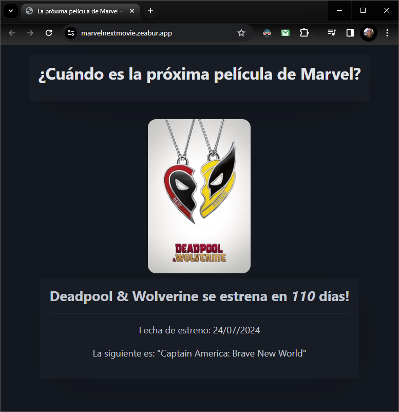

    

---

## PHP 8 desde cero

Video: [Curso para principiantes + Aplicación con Deploy (Midudev)](https://www.youtube.com/watch?v=BcGAPkjt_IE)

---

Instalar XAMPP para windows (Apache + MariaDB + PHP):

- https://www.apachefriends.org/es/index.html
- https://www.apachefriends.org/es/faq_windows.html

Verificar versión de PHP instalada:

`php -v`

Ejecutar código PHP desde la consola:

`php -r "echo 'Mensaje de prueba';"`

Crear y ejecutar servidor web local:

- Crear carpeta con archivo index.php que contenga:

  `<?php echo "Jonatandb"; ?>`

- Desde dentro de la carpeta, iniciar servidor PHP:

  `php -S localhost:8000`

- Acceder desde el navegador a:

  - http://localhost:8000

- Alternativa usando XAMPP:
  - Crear o mover carpeta con sitio web a la carpeta `htdocs` de XAMPP y acceder desde el navegador a:
    - http://localhost:8000/nombreCarpetaSitioWeb

---

Tutoriales PHP:

- https://www.php.net/manual/es/tutorial.php

- https://www.w3schools.com/php/default.asp
